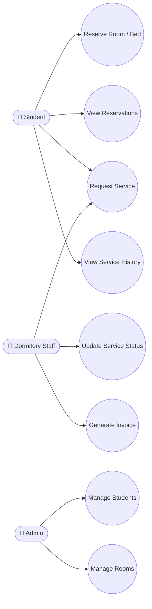

```mermaid
flowchart LR

    %% Actors
    Student([👤 Student])
    Staff([👤 Dormitory Staff])
    Admin([👤 Admin])

    %% Student Use Cases
    UC1((Reserve Room / Bed))
    UC2((View Reservations))
    UC3((Request Service))
    UC4((View Service History))

    %% Staff Use Cases
    UC5((Update Service Status))
    UC6((Generate Invoice))

    %% Admin Use Cases
    UC7((Manage Students))
    UC8((Manage Rooms))

    %% Connections
    Student --> UC1
    Student --> UC2
    Student --> UC3
    Student --> UC4

    Staff --> UC3
    Staff --> UC5
    Staff --> UC6

    Admin --> UC7
    Admin --> UC8
```

