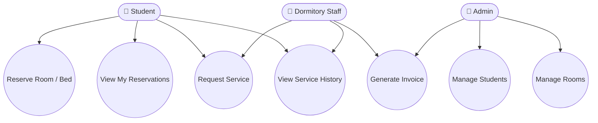

```mermaid
flowchart TD

    %% Actors
    Student([👤 Student])
    Staff([👤 Dormitory Staff])
    Admin([👤 Admin])

    %% Use Cases
    UC1((Reserve Room / Bed))
    UC2((View My Reservations))
    UC3((Request Service))
    UC4((Manage Students))
    UC5((Manage Rooms))
    UC6((Generate Invoice))
    UC7((View Service History))

    %% Connections
    Student --> UC1
    Student --> UC2
    Student --> UC3
    Student --> UC7

    Staff --> UC3
    Staff --> UC6
    Staff --> UC7

    Admin --> UC4
    Admin --> UC5
    Admin --> UC6
```
