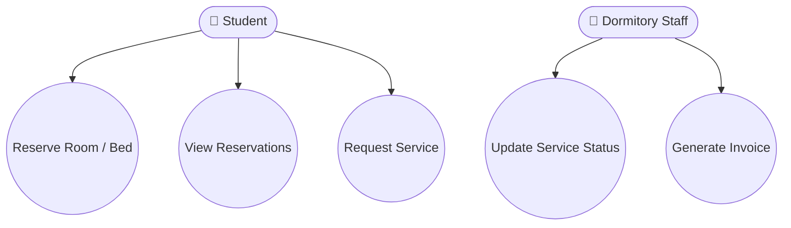

```mermaid
flowchart TD

    %% Actors
    Student([👤 Student])
    Staff([👤 Dormitory Staff])

    %% Use Cases
    UC1((Reserve Room / Bed))
    UC2((View Reservations))
    UC3((Request Service))
    UC4((Update Service Status))
    UC5((Generate Invoice))

    %% Connections
    Student --> UC1
    Student --> UC2
    Student --> UC3

    Staff --> UC4
    Staff --> UC5
```

