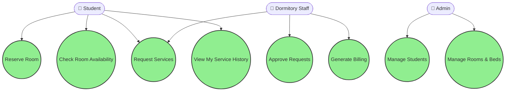

```mermaid
flowchart TD

    %% Actors
    Student([👤 Student])
    Staff([👤 Dormitory Staff])
    Admin([👤 Admin])

    %% Use Cases
    UC1((Reserve Room))
    UC2((Check Room Availability))
    UC3((Request Services))
    UC4((View My Service History))
    UC5((Approve Requests))
    UC6((Generate Billing))
    UC7((Manage Students))
    UC8((Manage Rooms & Beds))

    %% Connections
    Student --> UC1
    Student --> UC2
    Student --> UC3
    Student --> UC4

    Staff --> UC3
    Staff --> UC5
    Staff --> UC6

    Admin --> UC7
    Admin --> UC8

    %% Style Use Cases (تمام دایره‌ها سبز)
    style UC1 fill:#90EE90,stroke:#333,stroke-width:2px
    style UC2 fill:#90EE90,stroke:#333,stroke-width:2px
    style UC3 fill:#90EE90,stroke:#333,stroke-width:2px
    style UC4 fill:#90EE90,stroke:#333,stroke-width:2px
    style UC5 fill:#90EE90,stroke:#333,stroke-width:2px
    style UC6 fill:#90EE90,stroke:#333,stroke-width:2px
    style UC7 fill:#90EE90,stroke:#333,stroke-width:2px
    style UC8 fill:#90EE90,stroke:#333,stroke-width:2px
```
